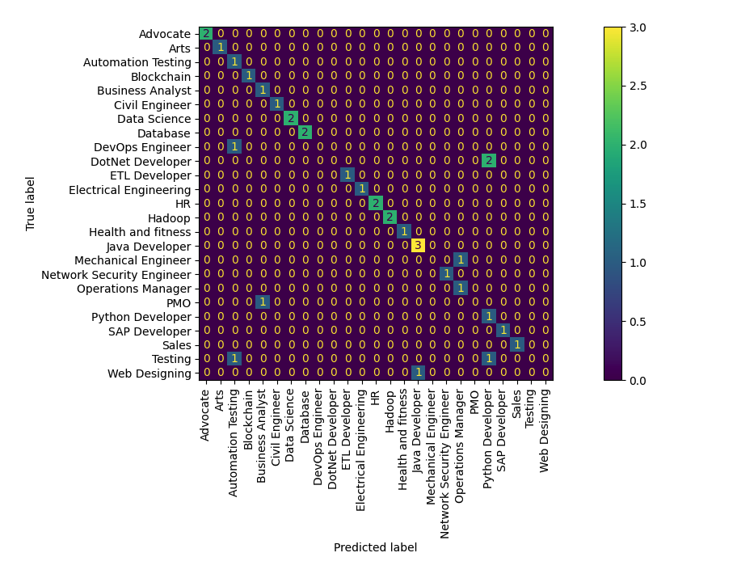
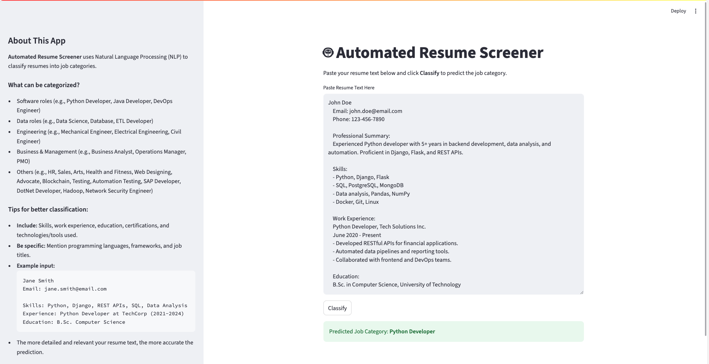

# 🤖 Automated Resume Screener

This project uses Natural Language Processing (NLP) to automatically classify resumes into job categories using a Logistic Regression model and TF-IDF features.

## 🚀 Features

- Resume text classification
- Interactive web app with Streamlit
- Trained on real resume data

## 🛠 Tech Stack

- Python
- scikit-learn
- Streamlit
- TF-IDF Vectorizer
- Logistic Regression

## 📊 Dataset

Public Kaggle dataset: [Resume Dataset](https://www.kaggle.com/datasets/gauravduttakiit/resume-dataset)

## ▶️ Run the App

```sh
git clone git@github.com:YourName/automated-resume-screener.git
cd automated-resume-screener
conda create -n resume-nlp python=3.10
conda activate resume-nlp
pip install -r requirements.txt
streamlit run app/app.py
```

## 🏋️ Model Training & Evaluation

After running `train_model.py`, the model is trained on the cleaned and deduplicated resume dataset. During training, the following steps and results are observed:

- **Duplicates removed:** 796 duplicate resumes were found and removed for better generalization.
- **Class imbalance warning:** Some classes have fewer than 5 samples (e.g., Operations Manager, Web Designing, PMO). This can make predictions for these classes less reliable.

- **Classification report:**  
  The model's performance on the test set is summarized below:

    ```
    precision    recall  f1-score   support

    Advocate                1.00      1.00      1.00         2
    Arts                    1.00      1.00      1.00         1
    Automation Testing      0.33      1.00      0.50         1
    Blockchain              1.00      1.00      1.00         1
    Business Analyst        0.50      1.00      0.67         1
    Civil Engineer          1.00      1.00      1.00         1
    Data Science            1.00      1.00      1.00         2
    Database                1.00      1.00      1.00         2
    DevOps Engineer         0.00      0.00      0.00         1
    DotNet Developer        0.00      0.00      0.00         2
    ETL Developer           1.00      1.00      1.00         1
    Electrical Engineering  1.00      1.00      1.00         1
    HR                      1.00      1.00      1.00         2
    Hadoop                  1.00      1.00      1.00         2
    Health and fitness      1.00      1.00      1.00         1
    Java Developer          0.75      1.00      0.86         3
    Mechanical Engineer     0.00      0.00      0.00         1
    Network Security Eng.   1.00      1.00      1.00         1
    Operations Manager      0.50      1.00      0.67         1
    PMO                     0.00      0.00      0.00         1
    Python Developer        0.25      1.00      0.40         1
    SAP Developer           1.00      1.00      1.00         1
    Sales                   1.00      1.00      1.00         1
    Testing                 0.00      0.00      0.00         2
    Web Designing           0.00      0.00      0.00         1

    accuracy                           0.76        34
    macro avg       0.65      0.76      0.68        34
    weighted avg    0.67      0.76      0.70        34
    ```

- **Cross-validated accuracy:**  
  `0.8316 ± 0.0553` (mean ± std), indicating the model performs reasonably well overall, but performance may vary across classes.

- **Sanity check (shuffled labels):**  
  Accuracy drops to `0.0419` when labels are shuffled, confirming the model is learning meaningful patterns and there is no data leakage.

### 📉 Confusion Matrix

The confusion matrix visualizes the model's predictions versus the true categories on the test set. This helps identify which classes are most often confused with each other.



**How to interpret:**  
- Each row represents the true class, and each column represents the predicted class.
- Diagonal values (top-left to bottom-right) show correct predictions.
- Off-diagonal values indicate misclassifications.
- Sparse or empty rows/columns for some classes (especially those with few samples) indicate the model struggles to predict or encounter those classes.

**Note:**  
Classes with very few samples (less than 5) may have unreliable metrics and may not be well represented in the confusion matrix.

---

## 📝 Example: Classifying a Resume

### Step-by-step

1. **Start the app** using the command above.
2. **Copy and paste the following sample resume** into the "Paste Resume Text Here" input box:

    ```
    John Doe
    Email: john.doe@email.com
    Phone: 123-456-7890

    Professional Summary:
    Experienced Python developer with 5+ years in backend development, data analysis, and automation. Proficient in Django, Flask, and REST APIs.

    Skills:
    - Python, Django, Flask
    - SQL, PostgreSQL, MongoDB
    - Data analysis, Pandas, NumPy
    - Docker, Git, Linux

    Work Experience:
    Python Developer, Tech Solutions Inc.
    June 2020 - Present
    - Developed RESTful APIs for financial applications.
    - Automated data pipelines and reporting tools.
    - Collaborated with frontend and DevOps teams.

    Education:
    B.Sc. in Computer Science, University of Technology
    ```

3. **Click the "Classify" button.**
4. **View the result:**  
   The app will display:

   ```
   Predicted Job Category: Python Developer
   ```

5. **Example UI Output:**  
   

This demonstrates how to use the app to classify a resume and what kind of output to expect.