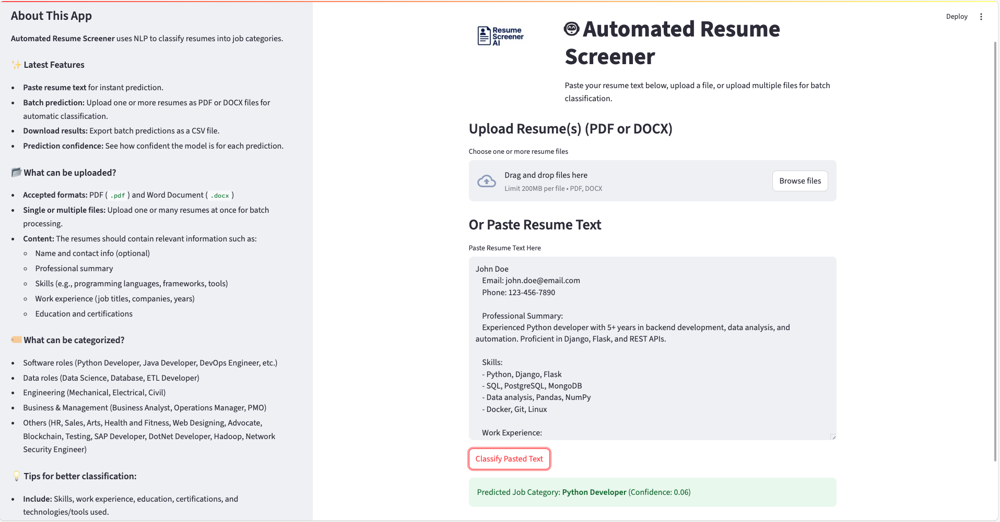

# 🤖 Automated Resume Screener

This project uses Natural Language Processing (NLP) to automatically classify resumes into job categories using a Logistic Regression model and TF-IDF features.

## 🚀 Features

- Resume text classification
- Interactive web app with Streamlit
- Trained on real resume data

## 🛠 Tech Stack

- Python
- scikit-learn
- Streamlit
- TF-IDF Vectorizer
- Logistic Regression

## 📊 Dataset

Public Kaggle dataset: [Resume Dataset](https://www.kaggle.com/datasets/gauravduttakiit/resume-dataset)

## ▶️ Run the App

```
git clone git@github.com:YourName/automated-resume-screener.git
cd automated-resume-screener
conda create -n resume-nlp python=3.10
conda activate resume-nlp
pip install -r requirements.txt
streamlit run app/app.py
```

## 📝 Example: Classifying a Resume

### Step-by-step

1. **Start the app** using the command above.
2. **Copy and paste the following sample resume** into the "Paste Resume Text Here" input box:

    ```
    John Doe
    Email: john.doe@email.com
    Phone: 123-456-7890

    Professional Summary:
    Experienced Python developer with 5+ years in backend development, data analysis, and automation. Proficient in Django, Flask, and REST APIs.

    Skills:
    - Python, Django, Flask
    - SQL, PostgreSQL, MongoDB
    - Data analysis, Pandas, NumPy
    - Docker, Git, Linux

    Work Experience:
    Python Developer, Tech Solutions Inc.
    June 2020 - Present
    - Developed RESTful APIs for financial applications.
    - Automated data pipelines and reporting tools.
    - Collaborated with frontend and DevOps teams.

    Education:
    B.Sc. in Computer Science, University of Technology
    ```

3. **Click the "Classify" button.**
4. **View the result:**  
   The app will display:

   ```
   Predicted Job Category: Python Developer
   ```

5. **Example UI Output:**  
   

This demonstrates how to use the app to classify a resume and what kind of output to expect.